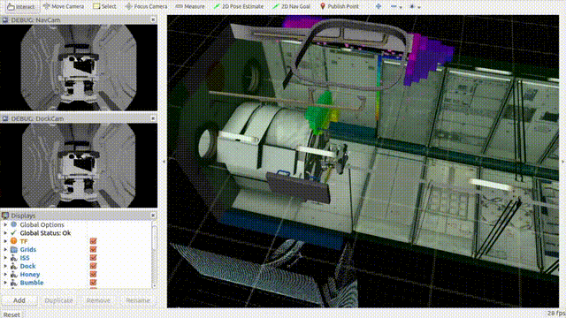

# Astrobee ROS

<div align="center">
  <a href="https://www.youtube.com/watch?v=HtXU6vCQlZI">
    
  </a>
</div>

Minimal ROS nodes (Python & C++) to plug custom autonomous controllers into the [Astrobee](https://nasa.github.io/astrobee/) simulator. Each template comes with a launch file and a few convenience hooks so you can focus on control, not boilerplate.

## What’s inside

* **Python node**: `nodes/python_ros_node_template.py`
* **C++ node**: `nodes/cpp_ros_node_template.cpp`
* **Launch files**: see `launch/` (Python and C++ variants)
* **Sim bring-up**: `astrobee_sim.launch` (spins up Astrobee + world)

## Tested setup

* Ubuntu 18.04
* ROS Melodic
* Python 3.8

> Other combos may work, but the above is what this repo has been verified on.

## Install

Make sure you’ve completed the official [Astrobee installation](https://nasa.github.io/astrobee/html/md_INSTALL.html) first. Then:

```bash
# assuming your catkin workspace is ~/catkin_ws
cd ~/catkin_ws
git clone https://github.com/ArghyaChatterjee/astrobee_ros.git src/astrobee_ros
catkin build        # or: catkin_make if you don't use catkin-tools
source devel/setup.bash
```

If `python-catkin-tools` isn’t installed, use `catkin_make`.

## Quick start (simulation + template)

1. **Start the simulator**

```bash
roslaunch astrobee_ros astrobee_sim.launch
```

2. **Bring up one of the templates** (pick one)

```bash
# Python
roslaunch astrobee_ros python_template_interface.launch

# or C++
roslaunch astrobee_ros cpp_template_interface.launch
```

3. **Clear any faulted state** (for the `honey` robot)

```bash
rostopic pub /honey/mgt/sys_monitor/state ff_msgs/FaultState '{state: 0}'
```

4. **Start the template node**

```bash
rosservice call /honey/start "data: true"
```

You should now see something like `Sleeping...` followed by messages such as `Elapsed time: 0` in the node console. That means the node is alive and ready; by default it doesn’t send a control input yet.

## Plug in your controller

Both templates expose a single place where you set the control command that gets sent to the robot each loop.

* **Python**: edit `nodes/python_ros_node_template.py` and populate `self.u_traj`
* **C++**: edit `nodes/cpp_ros_node_template.cpp` and populate `control_input_`

Two common patterns:

1. **External controller node**
   Subscribe in the template to a topic your controller publishes, and write into `self.u_traj` (Python) or `control_input_` (C++).

2. **Inline controller**
   Implement your controller directly in the template’s update loop and set the control variables there.

> Tip: Search for the comments marked `TODO(control)` in each template to find the right spot quickly.

## Useful topics & services

* Start/stop service (per robot, e.g., `honey`): `/honey/start` (`std_srvs/SetBool`)
* Fault state override: `/honey/mgt/sys_monitor/state` (`ff_msgs/FaultState`)

If you prefer a different Astrobee robot (`bumble`, `queen`), change the robot name in the launch file or via a `robot:=` arg if provided.

## Repo layout

```
astrobee_ros/
├─ launch/
│  ├─ astrobee_sim.launch
│  ├─ python_template_interface.launch
│  └─ cpp_template_interface.launch
├─ nodes/
│  ├─ python_ros_node_template.py
│  └─ cpp_ros_node_template.cpp
└─ media/
   └─ astrobee.gif
```

## Troubleshooting

* **Template never “starts”**: confirm you called `/honey/start` with `data: true`.
* **Robot stuck faulted**: make sure you published `ff_msgs/FaultState` with `{state: 0}` on the correct robot namespace.
* **Build issues**: verify ROS env is sourced and Astrobee was installed per the official guide.

